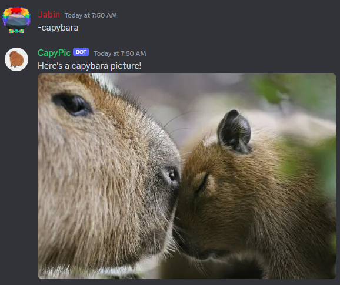
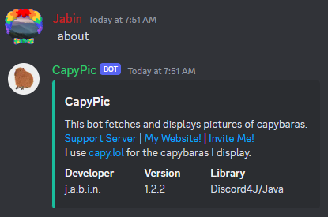
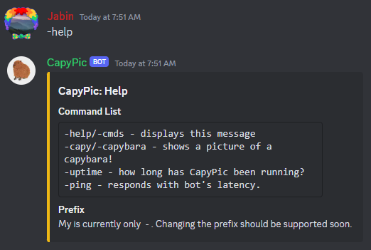

# CapyPic  
The ultimate capybara picture Discord bot.  
**[http://invite.capy.jabinstech.net](Invite Now!)**
## Just the basics.  
CapyPic currently includes 6 commands.  
`-capybara` - you know what that does.  
`-capy` - does the same thing as `-capybara`  
`-ping` - returns bot's response time  
`-about` - about bot.  
`-help` or `-cmds` - help menu & list of commands.  
`-servers` - returns the number of guilds CapyPic is a part of.  
*There are also a couple owner-only commands that can ONLY be run by `j.a.b.i.n.`, including commands to manage the bot remotely, like to shut it down.  
## Capybara Fan Club: The official home of CapyPic!  
*Note: this is not the support server, this is a fan club for all capybara fans!*  
Join the **Capybara Fan Club** today! We are a fun community and we love capybaras!
[Join Now!](https://discord.gg/EsmjrtPnHv)
## How it works  
CapyPic is a fork of the currently in-development Jot3 bot, with just the basics you want for capybaras!
It uses the API from [capy.lol](https://capy.lol/) to get all of its capybara pictures.
CapyPic is written in Java using the [Discord4J](https://discord4j.com/) library.  
## Get support.  
Hop into my support server!
[https://discord.gg/qaQ2xH52aq](https://discord.gg/qaQ2xH52aq)  
## See it in action!  
  
  
  
## Links  
[Privacy](/privacy) | [Terms of Service](/terms)  
